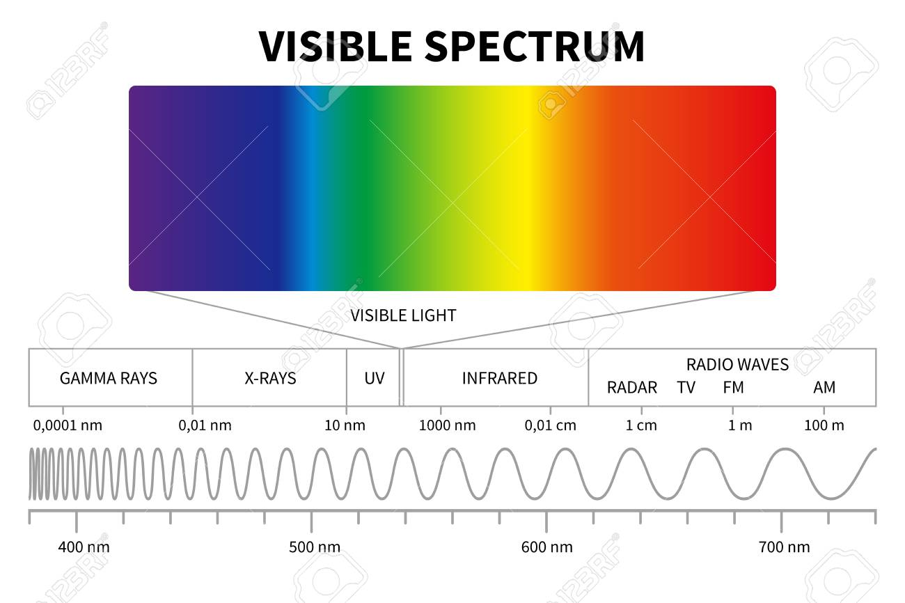
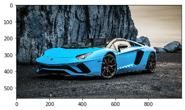
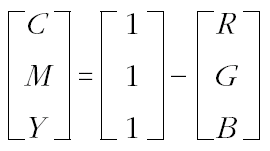
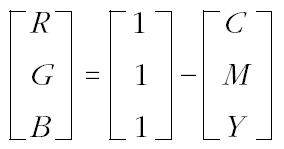
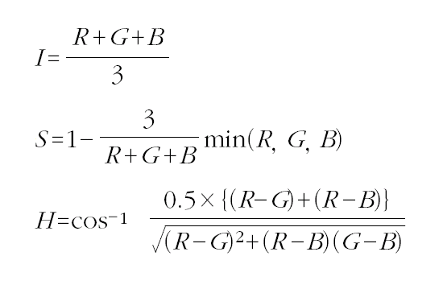
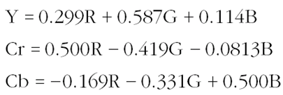

# 디지털 영상

### 1. 빛과 색, 시각

* 빛과 색
  * 가시광선
    * 인간이 볼 수 있는 빛의 영역
    * 인간은 가시광선으로 색을 인식
    * 파장은 길이에 따라 성질이 변화하여 각각의 색깔로 나타나는데, 빨->보 갈수록 파장이 짧아짐



* 컬러 디지털 영상과 흑백 디지털 영상으로 구분
  * 흑백 디지털 영상 - 이진영상(검/흰)과 그레이 레벨 영상(검/회/흰)으로 분류
  * 컬러 디지털 영상
    * 색 정보를 세가지 지각변수(색상, 채도, 명도)로 인식
    * 색상+채도=색도(Chromaticity)

### 2. 컬러 모델

* 컬러모델->RGB, CMY(K), HSI, YCrCb, YUV등이 있음
  * RGB컬러모델 ->Red,Green,Blue 세 가지 색상 값을 이용해 색 표현
  * R/G/B 각각이 2^8가지의 색상을 표현-> 2^24가지 색상을 표현 가능(16,777,216)
  * 그레이 레벨 구현

```python
import numpy as np
import matplotlib.pyplot as plt
%matplotlib inline

a=np.array([
    [0,0,0,0],
    [85,85,85,85],
    [170,170,170,170],
    [255,255,255,255]
],dtype='uint8') # numpy 쓰는 이유 -> 빠른 연산, 직관적 연산이 가능
plt.imshow(a,cmap='gray')
```


```python
b=a+5
print(b)
plt.imshow(b,cmap='gray')
```


​				-> 1Byte 정수이므로 255+5=4가 되어버림

* 컬러레벨 구현

```python
r=np.array([
    [255,255,255,255],
    [0,0,0,0],
    [0,0,0,0],
    [255,255,255,255]
],dtype='uint8')

g=np.array([
    [0,0,0,0],
    [255,255,255,255],
    [0,0,0,0],
    [255,255,255,255]
],dtype='uint8')

b=np.array([
    [0,0,0,0],
    [0,0,0,0],
    [255,255,255,255],
    [0,0,0,0]
],dtype='uint8')

colors=np.dstack([r,g,b])

plt.imshow(colors)
```


   * openCV의 경우 일반적인 RGB 구성이 아닌 BGR을 사용

  ->R과 B가 바뀌어서 표현됨




```python
#R과 B의 값 서로 바꾸기

b=img[:,:,0]
g=img[:,:,1]
r=img[:,:,2]

rgb=np.dstack([r,g,b])

plt.imshow(rgb)

#cvtColor 사용하기

img_cvt=cv2.cvtColor(img, cv2.COLOR_BGR2RGB)

plt.imshow(img_cvt)
```


```python
# 색상 조절
r=r+30
g=g+30

rgb=np.dstack([r,g,b])

plt.imshow(rgb)
```


.png)

* CMY컬러모델

  * 프린터에서 주로 사용

* 컬러코드 모델 변환(RGB-CMY)

  * RGB ->CMY

    ​	

  * CMY -> RGB

    ​	

* HSI 모델

  * Hue(색), Saturation(채도), Intensity(명도)를 사용하여 색을 표현

  * RGB->HSI

    

* YCrCb모델

  * 명도에 더 민감한 인간 눈을 감안하여 명도를 Y, 푸른색 정보를 Cr, 붉은색 정보를 Cb로 기호화

  * RGB -> YCrCb

    

* 흑백만들기

  ```python
  img=cv2.imread("people.jpg")
  
  result=img.copy()
  for r in range(h.shape[0]):
      for c in range(h.shape[1]):
          col=(img[r,c,0]+img[r,c,1]+img[r,c,2])/3
          result[r,c,0]=col
          result[r,c,1]=col
          result[r,c,2]=col
  plt.imshow(cv2.cvtColor(result, cv2.COLOR_BGR2RGB))
  ```

  .png)

  * 해당 코드 출력시 오버플로우로 인하여 255 넘은 값들에서 오류 발생

    -> int 선언을 해줘야 함

    ```python
    col=(int(img[r,c,0])+int(img[r,c,1])+int(img[r,c,2]))/3
    ```

    .png)

  * int()로 연산시 정상적으로 출력되는것을 볼 수 있음

* 스킨과 마스크 분리하기

  ```python
  .pngimg=cv2.imread("people_b.jpg")
  
  hsv=cv2.cvtColor(img,cv2.COLOR_BGR2HSV)
  h=hsv[:,:,0]
  s=hsv[:,:,1]
  v=hsv[:,:,2]
  
  skin=img.copy()
  mask=img.copy()
  
  for r in range(h.shape[0]):
      for c in range(h.shape[1]):
          if h[r,c]>=0 and h[r,c]<=20 and s[r,c]>=48 and v[r,c]>=30:
              skin[r,c,:]=img[r,c,:]
              mask[r,c,:]=255
          else:
              skin[r,c,:]=0
              mask[r,c,:]=[255,0,0]
   
  add=np.hstack([img,skin,mask])
  
  plt.imshow(cv2.cvtColor(add, cv2.COLOR_BGR2RGB))
  plt.show()
  ```

  .png)

* 크로마키에서 배경 제거하는 코드

```python
import numpy as np
import matplotlib.pyplot as plt
from PIL import Image
%matplotlib inline
import cv2

# 패치이미지(TRAIN) 가져오기
train=cv2.imread('patch2.png')
b,g,r=cv2.split(train)

# 패치 이미지의 RGB 분석을 통한 최대값 찾기
hr=plt.hist(r.ravel(),256,[0,256],color='r')
hg=plt.hist(g.ravel(),256,[0,256],color='g')
hb=plt.hist(b.ravel(),256,[0,256],color='b')

maxr=(np.where(hr[0]==np.max(hr[0])))[0][0]
maxg=(np.where(hg[0]==np.max(hg[0])))[0][0]
maxb=(np.where(hb[0]==np.max(hb[0])))[0][0]

print(maxr,'\n',maxg,'\n',maxb)

# 크로마키 이미지 가져오기
test=cv2.imread('chroma_people.jpg')
test_rgb=test.copy()
test_hsv=test.copy()

# RGB값이 최다빈도인 픽셀 [0,0,0] 처리하기
for r in range(test.shape[0]):
    for c in range(test.shape[1]):
        if np.array_equal(test[r,c,:],[maxb,maxg,maxr]):
            test_rgb[r,c,:]=[0,0,0]
# 인쇄
plt.figure(figsize=(30,10))            
plt.imshow(cv2.cvtColor(test_rgb,cv2.COLOR_BGR2RGB))
```

.png)

​		-> RGB 최다빈도인 픽셀만 제거하여 제거하므로 근처 추출하려는 이미지 근처 픽셀의 경우 남아있음